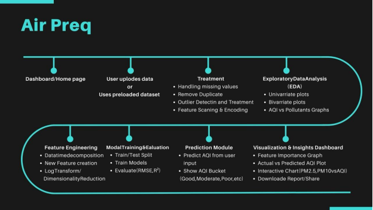

# AirPreQ – Air Quality Prediction Web Application



**AirPreQ** is a Flask-based web application that predicts and visualises Air Quality Index (AQI) using machine learning. It supports three modes of analysis: a built-in predefined dataset, user-uploaded CSV files, and live data fetched from the AirVisual API.

---

## Table of Contents

- [Overview](#overview)
- [Team](#team)
- [Features](#features)
- [Tech Stack](#tech-stack)
- [Project Structure](#project-structure)
- [Getting Started](#getting-started)
  - [Prerequisites](#prerequisites)
  - [Installation](#installation)
  - [Configuration](#configuration)
  - [Running the App](#running-the-app)
- [Usage](#usage)
- [Machine Learning Models](#machine-learning-models)
- [Deployment](#deployment)
- [Dataset Format](#dataset-format)
- [API Reference](#api-reference)
- [Contributing](#contributing)

---

## Overview

Air quality is a critical public health concern. AirPreQ allows users to:

1. Explore a curated air quality dataset with interactive charts.
2. Upload their own air quality CSV data for instant analysis.
3. Fetch real-time pollution data for any city worldwide and get an AQI prediction.

The backend trains two regression models (Linear Regression and Random Forest) on the available data and exposes predictions and evaluation metrics through a clean web interface.

This project was built for the **Naan Mudhalvan** subject *Experienced Based Project Learning – Data Science*.

---

## Team

| # | Name | Role |
|---|---|---|
| 1 | **Sivabalan V** | Team Leader / Project Manager |
| 2 | **Dhyanesh V** | Backend & Deployment Developer |
| 3 | **Semmozhiyan N S** | Machine Learning Engineer |
| 4 | **Sri Sabarish U** | Data Collection & Preprocessing Lead |
| 5 | **Chandru M** | Frontend Developer & Documentation Lead |

---

## Features

| Feature | Description |
|---|---|
| **Predefined Analysis** | Correlation heatmap, AQI trend over time, and feature importance charts generated from a built-in dataset |
| **Upload Your Data** | Upload a CSV file and receive model evaluation metrics (RMSE, R²) plus the same interactive charts |
| **Live AQI Prediction** | Enter a city, state, and country to fetch real-time pollutant data and predict the AQI |
| **Interactive Visualisations** | All charts are powered by Plotly for zoom, pan, and hover interactions |
| **Responsive UI** | Multi-page Flask app with navigation, About, and Contact pages |

---

## Tech Stack

| Layer | Technology |
|---|---|
| Web Framework | [Flask 3.1](https://flask.palletsprojects.com/) |
| Data Processing | [Pandas 2.2](https://pandas.pydata.org/), [scikit-learn 1.6](https://scikit-learn.org/) |
| Visualisation | [Plotly 6](https://plotly.com/python/), [Seaborn 0.13](https://seaborn.pydata.org/), [Matplotlib 3.9](https://matplotlib.org/) |
| HTTP Client | [Requests 2.32](https://docs.python-requests.org/) |
| Production Server | [Gunicorn](https://gunicorn.org/) |
| Deployment | [Render](https://render.com/) |
| Language | Python 3 |

---

## Project Structure

```
NM_Sivabalan_AirPreQ/
├── app.py                   # Flask application entry point & route definitions
├── requirements.txt         # Python dependencies
├── render.yaml              # Render deployment configuration
├── __init__.py
│
├── data/
│   └── sample_dataset.csv   # Built-in air quality dataset
│
├── modules/                 # Core application logic
│   ├── __init__.py
│   ├── api_fetcher.py       # Fetches live AQI data from AirVisual API
│   ├── data_preprocessing.py# Data cleaning, scaling, and encoding
│   ├── model_training.py    # Trains Linear Regression & Random Forest models
│   ├── model_evaluation.py  # Computes RMSE and R² metrics
│   ├── visualizations.py    # Generates Plotly charts
│   └── utils.py             # Shared utility helpers
│
├── templates/               # Jinja2 HTML templates
│   ├── base.html
│   ├── home.html
│   ├── about.html
│   ├── contact.html
│   ├── analysis_predefined.html
│   ├── analysis_upload.html
│   └── analysis_live.html
│
├── static/                  # CSS, JavaScript, and image assets
└── AirPreQ.png              # Project logo / banner
```

---

## Getting Started

### Prerequisites

- Python 3.9 or higher
- `pip` package manager
- An [AirVisual API key](https://www.iqair.com/air-pollution-data-api) (free tier available) for the **Live Analysis** feature

### Installation

1. **Clone the repository**

   ```bash
   git clone https://github.com/Siva-Balan-V/NM_Sivabalan_AirPreQ.git
   cd NM_Sivabalan_AirPreQ
   ```

2. **Create and activate a virtual environment** *(recommended)*

   ```bash
   python -m venv venv
   # macOS / Linux
   source venv/bin/activate
   # Windows
   venv\Scripts\activate
   ```

3. **Install dependencies**

   ```bash
   pip install -r requirements.txt
   ```

### Configuration

Open `modules/api_fetcher.py` and replace the placeholder API key with your actual AirVisual key:

```python
API_KEY = "your_actual_airvisual_api_key_here"
```

> **Note:** The predefined dataset analysis and CSV upload features work without an API key. Only the **Live Analysis** page requires one.

### Running the App

```bash
python app.py
```

The application starts on `http://127.0.0.1:5000` by default. Open that URL in your browser.

---

## Usage

| Page | URL | Description |
|---|---|---|
| Home | `/` | Landing page with navigation to all features |
| Predefined Analysis | `/analysis/predefined` | Charts and insights from the built-in dataset |
| Upload Analysis | `/analysis/upload` | Upload a CSV file; view metrics and charts |
| Live Analysis | `/analysis/live` | Enter city details to get a real-time AQI prediction |
| About | `/about` | About the project and team |
| Contact | `/contact` | Contact information |

---

## Machine Learning Models

Two regression models are trained every time the application starts (or when a new dataset is uploaded):

### Linear Regression
- Baseline model for AQI prediction.
- Fast to train; good for understanding linear relationships between pollutants and AQI.

### Random Forest Regressor
- Ensemble model with 100 decision trees.
- Captures non-linear interactions; provides **feature importance** rankings.
- Used for the live AQI prediction.

### Evaluation Metrics

| Metric | Description |
|---|---|
| **RMSE** | Root Mean Squared Error – lower is better |
| **R²** | Coefficient of Determination – closer to 1.0 is better |

---

## Deployment

The application is configured for deployment on **[Render](https://render.com/)** via `render.yaml`:

```yaml
services:
  - type: web
    name: airquality-app
    runtime: python
    buildCommand: pip install -r requirements.txt
    startCommand: python app.py
    envVars:
      - key: FLASK_ENV
        value: production
```

To deploy:

1. Fork this repository.
2. Create a new **Web Service** on Render and connect your GitHub repository.
3. Render will automatically detect `render.yaml` and configure the build.
4. Add your `API_KEY` as an environment variable in the Render dashboard.

---

## Dataset Format

Both the predefined dataset and any uploaded CSV must contain the following columns:

| Column | Description |
|---|---|
| `Date` | Date of measurement (any parseable format) |
| `City` | City name (optional; used for one-hot encoding) |
| `PM2.5` | Fine particulate matter (µg/m³) |
| `PM10` | Coarse particulate matter (µg/m³) |
| `NO` | Nitric oxide (µg/m³) |
| `NO2` | Nitrogen dioxide (µg/m³) |
| `NOx` | Nitrogen oxides (µg/m³) |
| `NH3` | Ammonia (µg/m³) |
| `CO` | Carbon monoxide (mg/m³) |
| `SO2` | Sulphur dioxide (µg/m³) |
| `O3` | Ozone (µg/m³) |
| `Benzene` | Benzene (µg/m³) |
| `Toluene` | Toluene (µg/m³) |
| `Xylene` | Xylene (µg/m³) |
| `AQI` | Air Quality Index (target variable) |
| `AQI_Bucket` | AQI category label (optional; dropped during preprocessing) |

---

## API Reference

The live analysis feature uses the **IQAir AirVisual API v2**:

- **Endpoint**: `GET https://api.airvisual.com/v2/city`
- **Parameters**: `city`, `state`, `country`, `key`
- **Free tier**: 10,000 calls/month

Obtain your API key at [iqair.com/air-pollution-data-api](https://www.iqair.com/air-pollution-data-api).

---

## Contributing

Contributions are welcome! To get started:

1. Fork the repository.
2. Create a feature branch: `git checkout -b feature/your-feature-name`
3. Commit your changes: `git commit -m "Add your feature"`
4. Push to the branch: `git push origin feature/your-feature-name`
5. Open a Pull Request.

Please ensure your code follows the existing style and that the application runs without errors before submitting.
